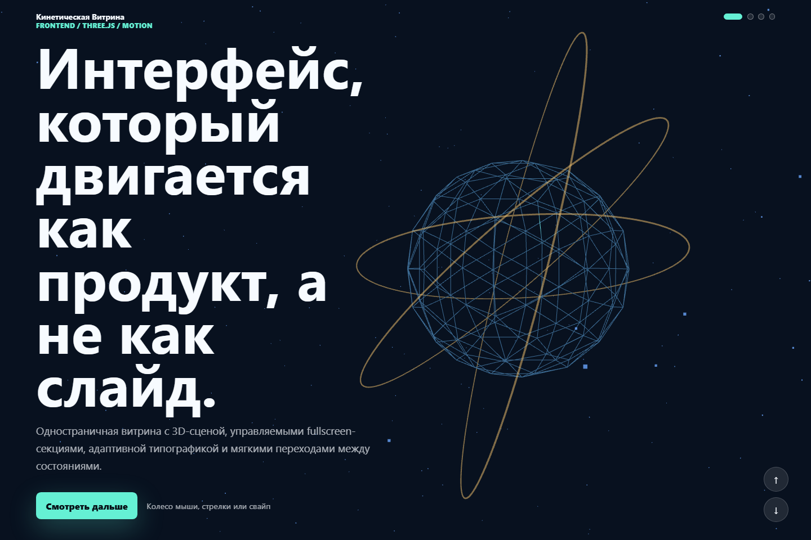
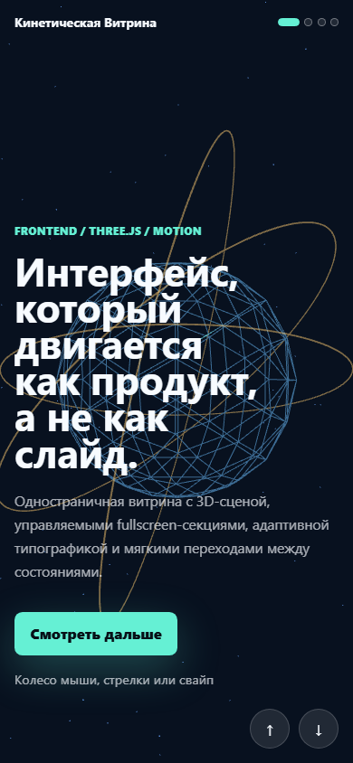

# Кинетическая витрина

Чистый frontend-проект для портфолио: fullscreen-секции, плавные переходы, адаптивный интерфейс и интерактивная 3D-сцена на Three.js.
## [ССЫЛКА](https://snanelx.github.io/kinetic-three-showcase)
## Стек

- Vite
- TypeScript
- Three.js
- HTML/CSS без UI-фреймворка

## Что есть в проекте

- Секции на весь экран.
- Переходы колесом мыши, стрелками клавиатуры, кнопками и свайпом.
- Three.js-сцена с частицами, 3D-ядром и кольцами.
- Смена палитры и поведения 3D-сцены при переходе между секциями.
- Полностью русскоязычный интерфейс.
- Адаптив под desktop, tablet и mobile.

## Скриншоты

### Desktop



### Mobile



## Запуск

```bash
npm install
npm run dev
```

Проект откроется на:

```txt
http://localhost:5173
```

## Сборка

```bash
npm run build
```

## Проверка Three.js Canvas

```bash
npm run visual:check
```

Проверка запускает Playwright и убеждается, что WebGL canvas рендерит непустые пиксели на desktop и mobile viewport.
